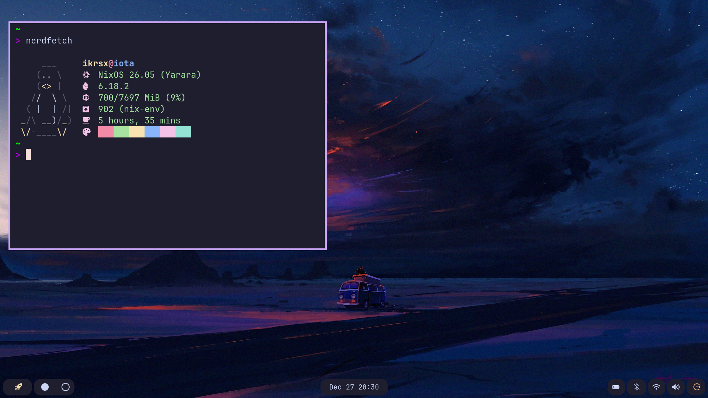

# Dotfiles
This repository consists of my dotfile configurations for my Linux setup.

## My Current Setup

- **Window Manager:** [Niri](https://github.com/YaLTeR/niri)
- **Bar:** [Waybar](https://github.com/Alexays/Waybar)
- **Lockscreen:** [Hyprlock](https://github.com/hyprwm/hyprlock)
- **Wallpaper:** [Hyprpaper](https://github.com/hyprwm/hyprpaper)
- **Menu:** [Fuzzel](https://codeberg.org/dnkl/fuzzel)(Along with some custom [scripts](./fuzzel/scripts))]
- **Notification:** [Mako](https://github.com/emersion/mako)
- **Shell:** [Bash](http://gnu.org/software/bash/)
- **Terminal:** [Alacritty](https://github.com/alacritty/alacritty)
- **Theme:** [Catppuccin Mocha](https://github.com/catppuccin/catppuccin)
- **Text Editor:** [Neovim](https://github.com/neovim/neovim)

## Final Words
**You are totally free to use this repository for your own usecase**. You can also checkout my other repositories on which I am working on. Happy Coding! 😊
